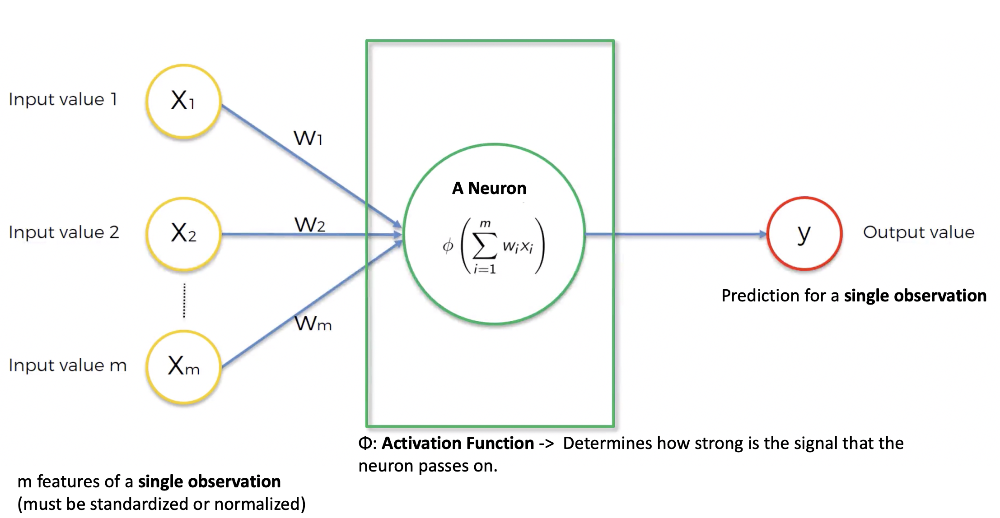

# The basic neuron model

- Input variables to neural network need to be standardized or normalized them
  - **Why?:**  All inputs get linearly combined and we don't want implicit weighting of features just because they
  have a different scale.
  - **Standardize or Normalize?:** It depends on the problem. Sometimes it is just a hyper parameter. 
     - Standardization: Distribution with a mean of 0 and variance 1.
     - When in doubt use standardization. 
   
 - The size of the output layer determines what your network does:
   - **Regression** -> One output neuron
   - **Binary classification** -> One output neuron
   - **n-class classification** -> n output neurons 