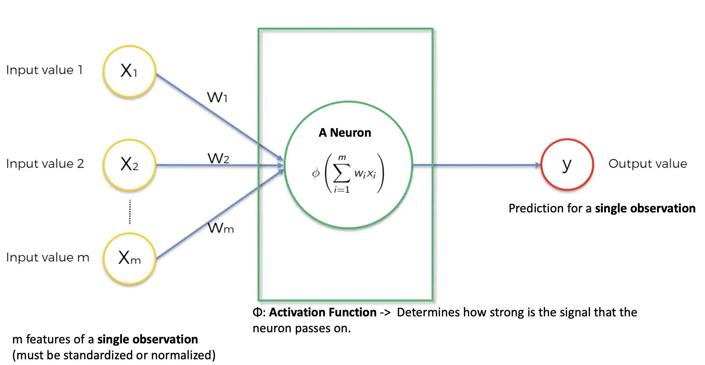
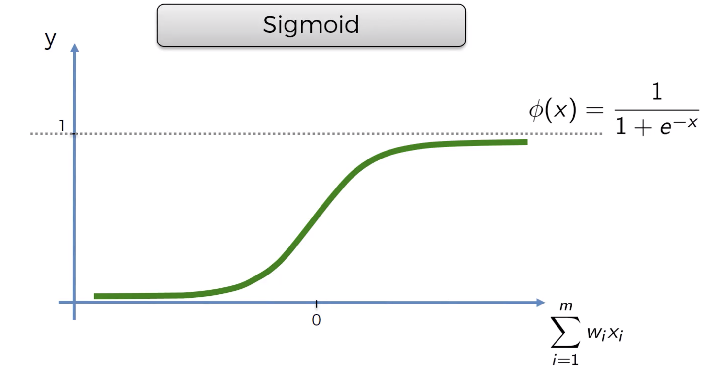
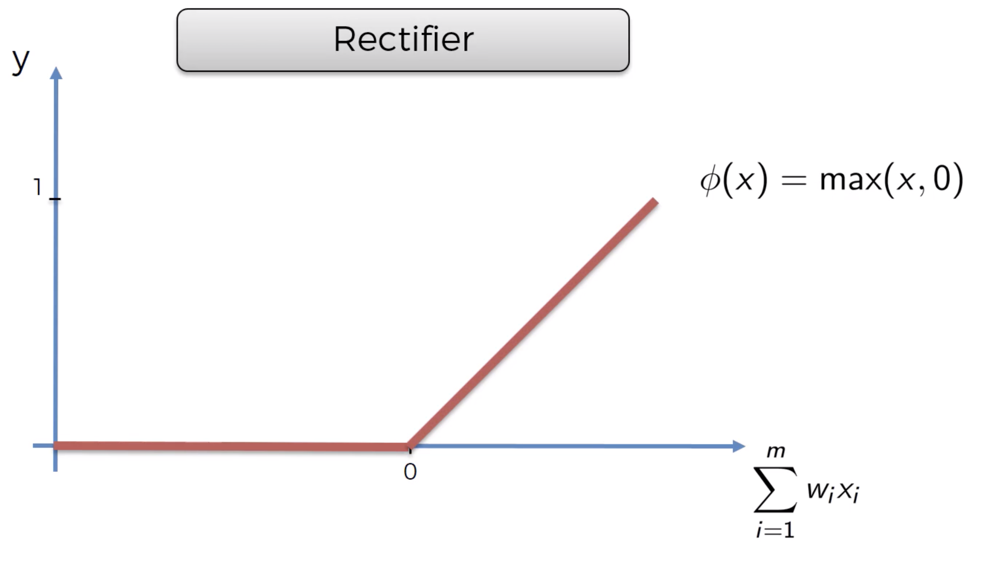
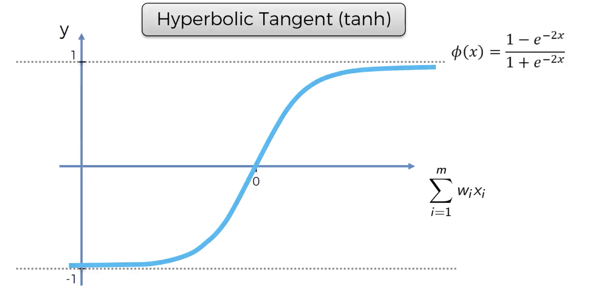
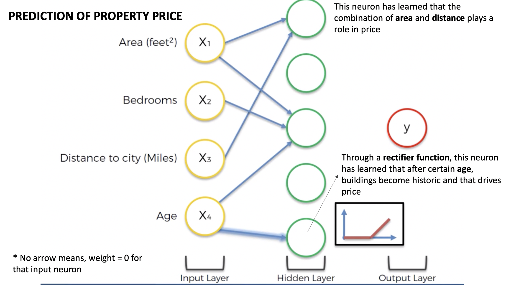
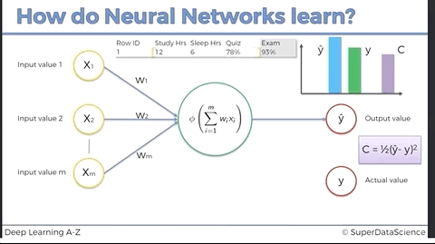
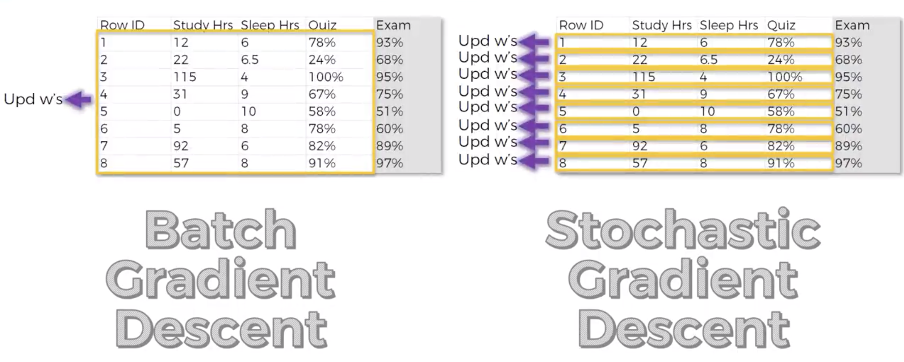

# ANN Intuition

## The Basic Neuron Model

- Input variables to neural network need to be standardized or normalized them
  - **Why?:**  All inputs get linearly combined and we don't want implicit weighting of features just because they
  have a different scale.
  - **Standardize or Normalize?:** It depends on the problem. Sometimes it is just a hyper parameter. 
     - Standardization: Distribution with a mean of 0 and variance 1.
     - When in doubt use standardization. 
   
 - The size of the output layer determines what your network does:
   - **Regression** -> One output neuron
   - **Binary classification** -> One output neuron
   - **n-class classification** -> n output neurons
   
   
## The Activation Function
There are many activation functions. We are going to talk about the 4 most used.

### Threshold

- Very simple.
- Can be used for binary classification in the output layer.
- The kink makes it non-differentiable. 

### Sigmoid

- It is good because it is smooth ->no kinks.
- Useful in output layer when trying to predict probability.
- If used in the output layer for binary classification, it becomes the probability of y=1 `P(Y=1)`.

### Rectifier

- Has kink.
- Despite kink, it is one of the most used activation functions.
- Typically used for hidden layers.

### Hyperbolic Tangent (tanh)

- Similar to sigmoid but goes from -1 to 1.
- Smooth, with no kinks.

### Common Combinations
A very common combination is using the rectifier for hidden layers and sigmoids for output layers.
See the ["coding an ann article"](2-coding-an-ann.md#which-activation-function-to-use) for more information.

## How do Neural Networks Make a Prediction
Once trained, we give to the input layer the features of a single property and data will
propagate through the hidden layers using the __weights__ found during training.

Through these weights, different hidden layer neurons focus on different aspects (higher order features).
As data gets propagated deeper through the hidden layers, the focus of each neuron (i.e what each neuron)
represents gets more and more complex.

Here is a toy example for the prediction of property price.

## How to Tran a Neural Networks

The following GIF shows a dummy example of a perceptron getting trained with a dummy dataset of 1
through multiple **epochs**. A perceptron is the simplest ANN possible, with just one neuron.

### Big Picture Intuition of How a Network is Trained Using Stochastic Gradient Descent 

The objective to find all the weights in all neurons that minimize the cost function over all the dataset. 
This is a classical optimization problem that can be tackled using optimization algorithms.

A simplified process of how a neural network gets trained using the `Stochastic Gradient Descent` algorithm is
given next.

Below this step-by-step we explain the different components and mention other algorithm variants that can 
also be used for training. 

The algorithm has following hyper parameters: `learning rate`, `max number of epochs`, `cost threshold`.

1. Randomly initialize the weights to small numbers close to 0 (but not 0)
2. Input the first (next random) observation of your dataset in the input layer, each feature in one input node.
3. **Forward propagation**: from left to right, use the current weights to calculate the output of each neuron
until we get a predicted result `y_hat` in the output layer.
4. Compare the predicted result `y_hat` with the actual value `y`. Calculate the generated error using the `cost function`
5. **Back propagation**: from right to left, the error gets propagated back. The algorithm allows us to discriminate
how much each weight is responsible for the error and adjust all the weights simultaneously. The `learning rate` decides
by how much we update the weights.
6. When the whole training set passes through the ANN, tha makes an epoch. Repeat from Step 2 and 
stop when the cost is lower than a threshold OR we have ran out of epochs OR we can't wait any longer.

### Cost Functions
There are many cost functions and different functions have different use cases.  
  - The most common by far is the `cuadratic cost`, also known as `mean squared error`, `maximum likelihood`, and `sum squared error`
     - `cost = 0.5 *sum{(y_hat - y_real)^2, over all datapoints in epoch}`
  - See [this post for a good list of other cost functions and their use cases](https://stats.stackexchange.com/questions/154879/a-list-of-cost-functions-used-in-neural-networks-alongside-applications).

### Learning Rate
The `learning rate` is a hyper paremeter that we have to decide before running the algorithm. The `learning rate`
decided *by how much* the weights should get adjusted relative to the error.
 - A bigger `learning rate` makes the training less stable (weights jump more), but it also gives the algorithm the 
 opportunity to finalise faster (if it doesn't diverge that is).
 - A smaller `learning rate` makes the algorithm slower, but also makes it more stable.

### Back propagation
**Back propagation** is the process of adjusting the weights on each neuron by back propagating the errors detected by 
the `cost function`. The math that powers the algorithm has to important properties:
- It allows us to discriminate how much each weight is responsible for the error.
- It allows us to adjust all the weights simultaneously.

### Comparison of Algorithms
This is optional content

#### Plain Gradient Descent (Batch Gradient Descent)
- A very popular optimization algorithm.
- The cost function gets evaluated once __all__ the observations in the dataset get estimated by the network using
the current weights. 
- Not used for training ANNs but is the core of all other algorithms that are used.
- More info about gradient descent https://iamtrask.github.io/2015/07/27/python-network-part2/
- __Pros__:
  - Deterministic: for a given set of initial weights, it always finds the same solution.
- __Cons__:
  - Requires the cost function to by _convex_ to guarantee a global minimum.
  - Requires all data to be loaded into memory. This is often not possible for large datasets.

#### Stochastic Gradient Descent

- Frequently used for training ANNs.
- Is stochastic because it picks observations at random.
- The `cost function` is evaluated and the weights are adjusted every time an observation gets estimated by the network using
the current weights. 
- __Pros__:
  - Helps us getting stuck in local minima.
- __Cons__:
  - Has much higher fluctuations compared to Batch Gradient Descent.

#### Mini-batch Gradient Descent
It is an "in between" algorithm where the `cost function` is evaluated and the weights are adjusted once a random sample
of `batch size` (hyper parameter) observations gets estimated the network using the current weights.

 