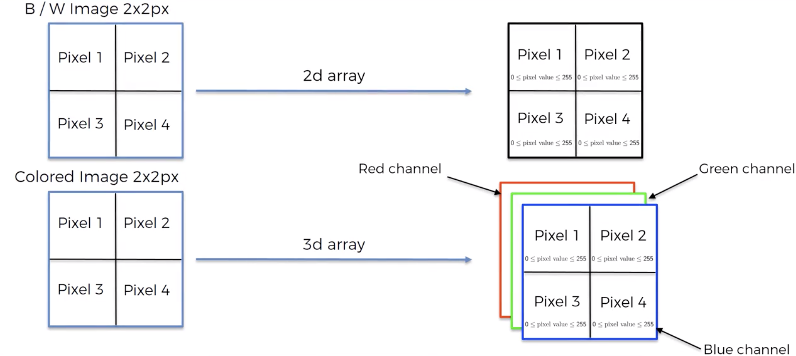

# Convolutional Neural Network (CNN) Intuition

## What are Convolutional Neural Networks Used for?

CNNs are typically used for image recognition tasks like image classification, but they also have applications
in recommender systems, natural language processing and time series.

In this work, we will anchor all the explanation of CNNs through image classification tasks, but the knowledge is
transferable to other applications.
  
## Input Structure
CNNs work with images / video-frames as inputs. This might look complicated, but under the hood images are just
N-dimensional arrays. CNNs work with these arrays as input.

For example, a Black and White image is a 2D array in which each cell contains a number between 0 and 255, indicating 
the "level of white" of the pixel.

A color image is a 3D array, with layers for red, green and blue (RGB). 

The next example shows how a "smiley face" can be represented using a simple _Black (1) OR White (0)_ encoding.

## Structure of a CNN (Steps)
### 1. Convolution Operation

In the __convolution__ step, _feature detectors_ are applied to the input image to transform it into multiple _feature maps_.

A __Feature Detector__ is a small grid of numbers (weights) that is designed to detect a specific feature in a image
(e.g. a filter to detect grass).
- Feature detectors are also called __filters__ or __kernels__.
- The weights of the __feature detectors__ are __LEARNED__ during training.  This is where the power of CNNs lie:
__The algorithm learns which features are important from the data.__  
- __Size of feature detectors:__ traditionally they are  3x3, but others sizes like 5x5 or 7x7 are also used.
- __Stride:__ the step (in pixels) we use to move the feature detector for creating the __feature map__. 
  - Typically people use 2, but this is hyper-parameter.
  - The size of the stride impacts the size of the __feature map__.
  

The __Feature Map__ is the result of applying a __feature detector__ to an input image. It is a spatial representation of 
how much is each feature detected in each area of the image (i.e. how active each area is for that particular feature).  
- __Feature Maps__ are also called __activation maps__ or __convolved features__.
- Are we losing information by applying a _feature detector_?
   - Yes and No.
   - __Yes__ because we are reducing the size to the original image, so _some_ information is lost.
   - __No__ because the learnt __feature detectors__ only focus on relevant features and get rid of information that is
    irrelevant for the problem at hand.

The __stride__ and the size of the __feature maps__ are related.  The higher the __stride__, the smaller the __feature map__.
- Smaller maps make all downstream processing easier because there is less information to handle.
- However, __strides__ that are too high may miss important areas on the image.

CNNs simultaneously learn and use different __feature detectors__ on the Convolution Layer. 
This means that multiple __feature maps__ are created from one image (one feature map per feature detector).

#### ReLU Layer
### 2. Pooling
### 3. Flattening
### 4. Full Connection

## Softmax & Cross-Entropy

## Complementary Readings
- https://www.superdatascience.com/blogs/the-ultimate-guide-to-convolutional-neural-networks-cnn