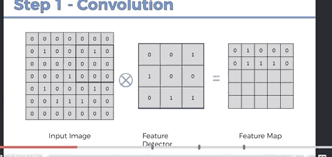

# Convolutional Neural Network (CNN) Intuition

## What are Convolutional Neural Networks Used for?

CNNs are typically used for image recognition tasks like image classification, but they also have applications
in recommender systems, natural language processing and time series.

In this work, we will anchor all the explanation of CNNs through image classification tasks, but the knowledge is
transferable to other applications.
  
## Input Structure
CNNs work with images / video-frames as inputs. This might look complicated, but under the hood images are just
N-dimensional arrays. CNNs work with these arrays as input.

For example, a Black and White image is a 2D array in which each cell contains a number between 0 and 255, indicating 
the "level of white" of the pixel.

A color image is a 3D array, with layers for red, green and blue (RGB). 

The next example shows how a "smiley face" can be represented using a simple _Black (1) OR White (0)_ encoding.

## Structure of a CNN (Steps)

This tool provides a nice visualization of how a CNN works: https://www.cs.ryerson.ca/~aharley/vis/conv/flat.html

### 1. Convolution Operation

In the __convolution__ step, _feature detectors_ are applied to the input image to transform it into multiple _feature maps_.

A __Feature Detector__ is a small grid of numbers (weights) that is designed to detect a specific feature in a image
(e.g. a filter to detect grass).
- Feature detectors are also called __filters__ or __kernels__.
- The weights of the __feature detectors__ are __LEARNED__ during training.  This is where the power of CNNs lie:
__The algorithm learns which features are important from the data.__  
- __Size of feature detectors:__ traditionally they are  3x3, but others sizes like 5x5 or 7x7 are also used.
- __Stride:__ the step (in pixels) we use to move the feature detector for creating the __feature map__. 
  - Typically people use 2, but this is hyper-parameter.
  - The size of the stride impacts the size of the __feature map__.
  - Mismatches between __image size__ and __stride__ are solved by adding 0-padding to the image.

The __Feature Map__ is the result of applying a __feature detector__ to an input image. It is a spatial representation of 
how much is each feature detected in each area of the image (i.e. how active each area is for that particular feature).  
- __Feature Maps__ are also called __activation maps__ or __convolved features__.
- Are we losing information by applying a _feature detector_?
   - Yes and No.
   - __Yes__ because we are reducing the size to the original image, so _some_ information is lost.
   - __No__ because the learnt __feature detectors__ only focus on relevant features and get rid of information that is
    irrelevant for the problem at hand.

The __stride__ and the size of the __feature maps__ are related.  The higher the __stride__, the smaller the __feature map__.
- Smaller maps make all downstream processing easier because there is less information to handle.
- However, __strides__ that are too high may miss important areas on the image.

CNNs simultaneously learn and use different __feature detectors__ on the Convolution Layer. 
This means that multiple __feature maps__ are created from one image (one feature map per feature detector).

In the end, __the hyperparams__ of the convolution layer are: __feature detector size__, __stride__ and __depth__
(number of feature detectors).

#### Clipping of negative values in the feature maps (ReLU layer)

Clipping of negative values in the __feature maps__ is done at the output of each convolution layer by using a
non linear activation function.
 - Clipping = map negative values to 0 or something close to 0.

Typically a __ReLU activation function__ is used on each cell of the feature map.  However, other functions like
__Sigmoid__ or a __Parametrized RelU (PReLU)__ (aka Leaky ReLU) can also be used.

The mathematical grounding of why this is needed is complicated and beyond the scope of this summary. It has been 
observed experimentally that, if the nonlinear clipping operation is removed, the system performance drops by a 
large margin.

An intuitive (non-precise) explanation of why this is needed is because we want a system architecture that promotes 
__feature detectors__ to learn weights that __ACTIVATE__ (i.e. go positive) when a feature is detected. With this in mind, 
a negative activation makes no sense.

Additionally, negative activation in layer 1 might be picked up by a negative filter in layer 2, resulting in a 
positive layer 2 output.  At this point, the system cannot differentiate between this 
_double negative_ activation and an activation that has been positive all the way.  This ultimately hurst robustness
and performance.

You can find more on the mathematical grounding of this here: https://arxiv.org/pdf/1609.04112.pdf

### 2. Downsampling via Pooling

Downsampling is done to make the network __more robust__ and to __prevent parameter explosion__.
- __Robustness__: pooling makes the network "less picky" about minor variances in the features the __filters__ detect.
In particular we don't want the network to be "tricked" by small differences of the same feature like slight rotations
or differences in texture (this is called spatial invariance).
- __Prevent parameter explosion__: Downsampling removes all the information that is not related to the 
the filter's feature.  In practice this reduces the number of parameters downstream which in turn prevents overfitting
and makes the processing faster.

#### Pooling Hyperparameters
- __Types__: there are multiple types of pooling (e.g. min pooling, max pooling, subsampling).
  - Max pooling is the most common.
- __Size of the pooling window__.
- __Stride:__ 2 is a very common setting to use.

More information about the details of different pooling configurations: http://ais.uni-bonn.de/papers/icann2010_maxpool.pdf
  - Especially parts 1 and 3.
  - In the paper: Subsampling = average pooling

### 3. Flattening

On the last layer of max pooled maps, we take each map and flatten it to form one big columnar vector
that will serve as the input layer for the next step.   

### 4. Full Connection

## Softmax & Cross-Entropy

## Complementary Readings
- https://www.superdatascience.com/blogs/the-ultimate-guide-to-convolutional-neural-networks-cnn