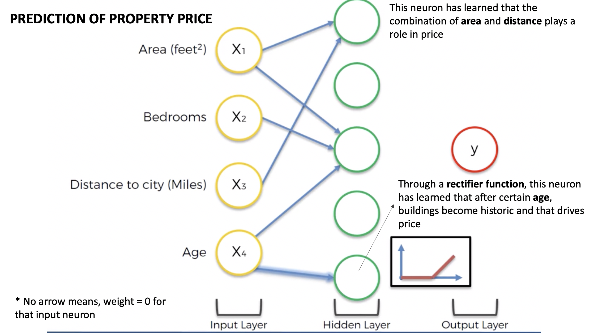
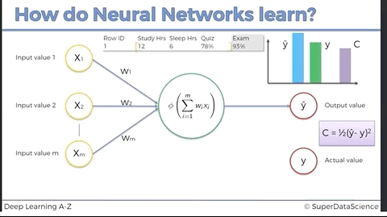

# ANN Intuition

## The Basic Neuron Model

- Input variables to neural network need to be standardized or normalized them
  - **Why?:**  All inputs get linearly combined and we don't want implicit weighting of features just because they
  have a different scale.
  - **Standardize or Normalize?:** It depends on the problem. Sometimes it is just a hyper parameter. 
     - Standardization: Distribution with a mean of 0 and variance 1.
     - When in doubt use standardization. 
   
 - The size of the output layer determines what your network does:
   - **Regression** -> One output neuron
   - **Binary classification** -> One output neuron
   - **n-class classification** -> n output neurons
   
   
## The Activation Function
There are many activation functions. We are going to talk about the 4 most used.

### Threshold

- Very simple.
- Can be used for binary classification in the output layer.
- The kink makes it non-differentiable. 

### Sigmoid

- It is good because it is smooth ->no kinks.
- Useful in output layer when trying to predict probability.
- If used in the output layer for binary classification, it becomes the probability of y=1 `P(Y=1)`.

### Rectifier

- Has kink.
- Despite kink, it is one of the most used activation functions.
- Typically used for hidden layers.

### Hyperbolic Tangent (tanh)

- Similar to sigmoid but goes from -1 to 1.
- Smooth, with no kinks.

### Common Combinations
A very common combination is using the rectifier for hidden layers and sigmoids for output layers.

## How do Neural Networks Make a Prediction
Once trained, we give to the input layer the features of a single property and data will
propagate through the hidden layers using the __weights__ found during training.

Through these weights, different hidden layer neurons focus on different aspects (higher order features).
As data gets propagated deeper through the hidden layers, the focus of each neuron (i.e what each neuron)
represents gets more and more complex.

Here is a toy example for the prediction of property price.

## How do Neural Networks Learn

The following GIF shows a dummy example of a perceptron getting trained with a dummy dataset of 1
through multiple **epochs**.

In every epoch (1 iteration through the dataset = 1 epoch):
1. The full dataset gets evaluated using the current weights. Each data point produces a `y_hat`.
1. `y_hat` is compared with the actual value `y` and a cost is calculated using a `cost function`.
1. The cost is used to adjust the weights. This is called `back propagation`.
1. Step 1 gets repeated. 
1. The training stops when the cost is lower than a threshold OR we have ran out of epochs OR we can't wait any longer.

See the [How do Neural Networks learn?](https://www.udemy.com/course/deeplearning/learn/lecture/6753752#overview) Udemy
video for fantastic explanation with a dataset that has more than one entry.

### Cost Functions
There are many cost functions and different functions have different use cases.  
  - The most common by far is the `cuadratic cost`, also known as `mean squared error`, `maximum likelihood`, and `sum squared error`
     - `cost = 0.5 *sum{(y_hat - y_real)^2, over all datapoints in epoch}`
  - See [this post for a good list of other cost functions and their use cases](https://stats.stackexchange.com/questions/154879/a-list-of-cost-functions-used-in-neural-networks-alongside-applications).

