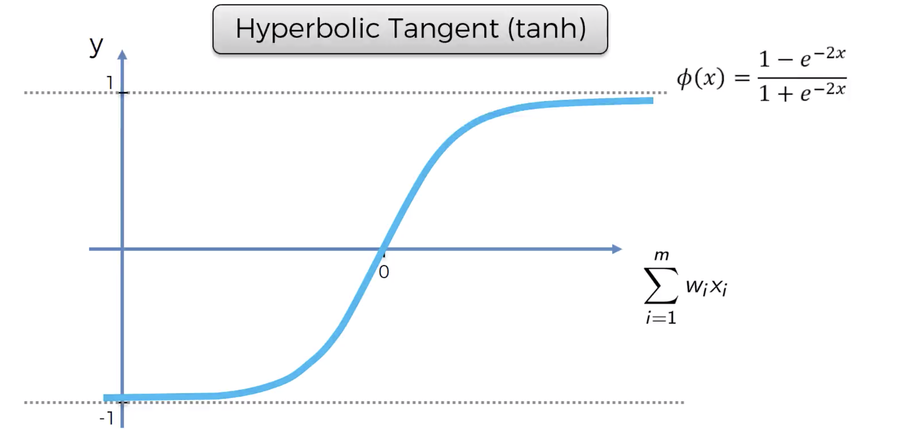

# ANN Intuition

## The Basic Neuron Model

- Input variables to neural network need to be standardized or normalized them
  - **Why?:**  All inputs get linearly combined and we don't want implicit weighting of features just because they
  have a different scale.
  - **Standardize or Normalize?:** It depends on the problem. Sometimes it is just a hyper parameter. 
     - Standardization: Distribution with a mean of 0 and variance 1.
     - When in doubt use standardization. 
   
 - The size of the output layer determines what your network does:
   - **Regression** -> One output neuron
   - **Binary classification** -> One output neuron
   - **n-class classification** -> n output neurons
   
   
## The Activation Function
There are many activation functions. We are going to talk about the 4 most used.

### Threshold

- Very simple.
- Can be used for binary classification in the output layer.
- The kink makes it non-differentiable. 

### Sigmoid

- It is good because it is smooth ->no kinks.
- Useful in output layer when trying to predict probability.
- If used in the output layer for binary classification, it becomes the probability of y=1 `P(Y=1)`.

### Rectifier

- Has kink.
- Despite kink, it is one of the most used activation functions.
- Typically used for hidden layers.

### Hyperbolic Tangent (tanh)

- Similar to sigmoid but goes from -1 to 1.
- Smooth, with no kinks.

### Common Combinations
A very common combination is using the rectifier for hidden layers and sigmoids for output layers.